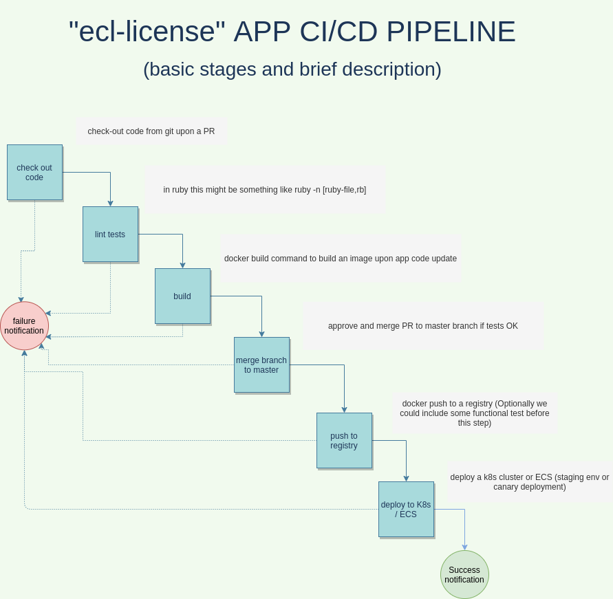

# ecl-challenge


## App overview

This is a simple ruby app that will expect input parameters (mainly "get", or "validate") along with some other optional parameters.

## Files overview

- Dockerfile: docker file with instructions to build the app image
- Jenkinsfile: dummy jenkins file describing the CICD pipeline we will describe below
- ecl-license.rb: ruby app with the necessary code


## Build instructions

```
docker build . -t ecl-license
```

## Execution instructions
- validate:
```
docker run --rm  --mount type=bind,source="$(pwd)",target=/share ecl-license  validate [key_to_check] [file (optional) ]
```
- get:
```
docker run --rm  --mount type=bind,source="$(pwd)",target=/share ecl-license  get registry.txt

    **NOTE: upon `docker run ...` execution the standard output has been redirected to 'stdout' file 
```


##  Disclaimers  :)  

1. I did several assumptions to avoid asking to clarify some FRs
2. I'm not all handling potential failures, time constraint.


## CI / CD pipeline

